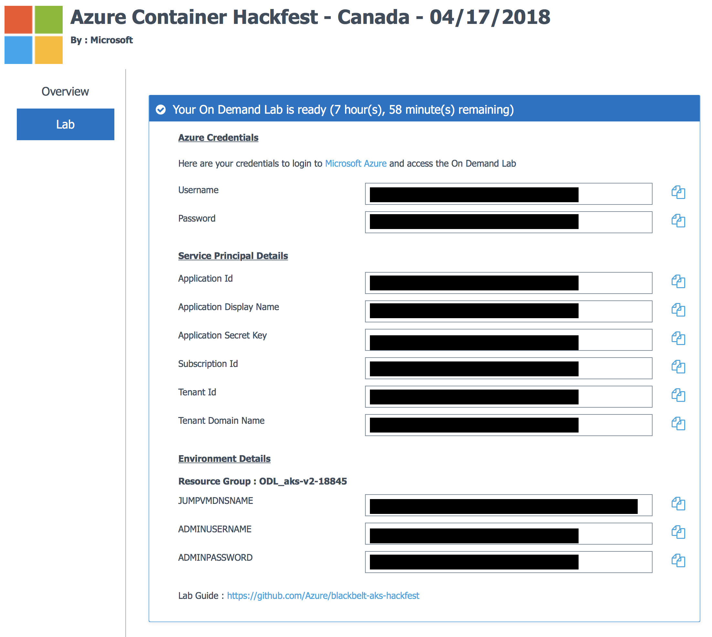

# Connecting to Remote Environment

We will leverage a remote Linux Virtual Machine that has Docker installed to run our commands on.  We will use the Azure Cloud Shell to connect to this remote machine.  You will have been provided credentials in the previous section [00_Lab_Setup](../00_Lab_Setup).

Your Credentials should look like the following screenshot:


1. Open Azure Cloud Shell in your [Azure portal](https://portal.azure.com)
    - Use the Azure Credentials provided to you in the previous section [00_Lab_Setup](../00_Lab_Setup) to login to Azure
        - Your username will look like: ```randomuserid@somelab.onmicrosoft.com```
    - Open an Azure Cloud Shell for Bash instance if one is not open already
        - This can be found in the top right corner of your Azure Portal
        - 

2. Once your Cloud Shell for Bash is up and running you will need to remote into your provided Linux VM via SSH
    - Use the Jumpbox VM Credentials provided to you in the previous section [00_Lab_Setup](../00_Lab_Setup) to login to the remote VM
    - Your command will look like:
        - ```ssh userid@jump-vm-uuid.eastus.cloudapp.azure.com```
        - You will be prompted for a password
    - You will now use this remote environment to run the majority of exercises for the hands on lab
