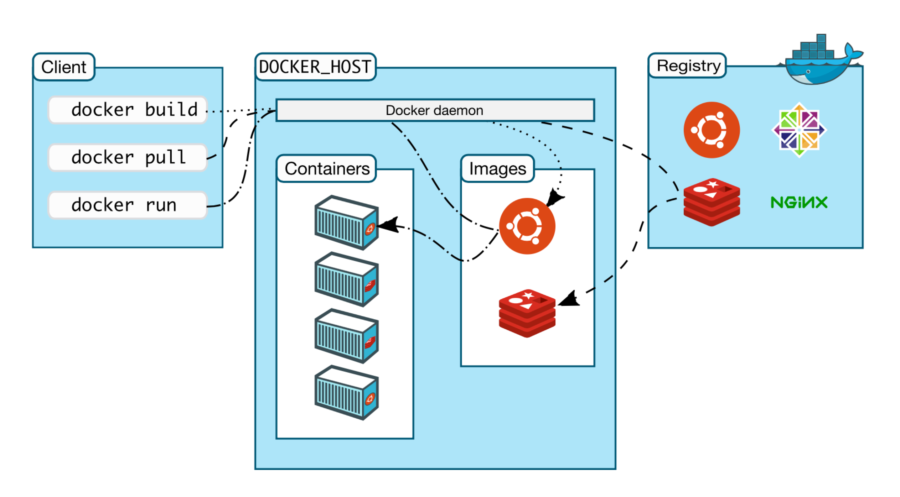
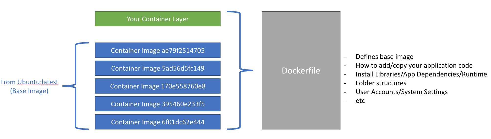

# An Introduction to Docker

Docker is both the name of a company (Docker Inc.) and an ecosystem of tools for creating, maintaining and running Docker Containers. This eco system can generally be broken down into the following:
- Docker CLI (aka Docker Command Line, aka Docker Client)
    - The command line tool that issues commands to a Docker Host (aka "Docker Engine")
- Docker-Machine
    - A command line tool for provisioning a Docker Host machine remotely, across multiple target platforms (i.e. vmware, bare metal, Azure etc.)
- Docker Hub
    - A central repository of Docker Images to be shared publicly/privately.  Think of it as your "Source Control" for Docker Images.
- Docker Host
    - The underlying engine/daemon that will manage the lifecycle of your running container instances, build and store Docker images locally.
- Docker Swarm
    - An Docker Container Orchestration engine.  It will manage all your containers across hosts in a distributed compute cluster.  Think of it as a hypervisor...kinda.

