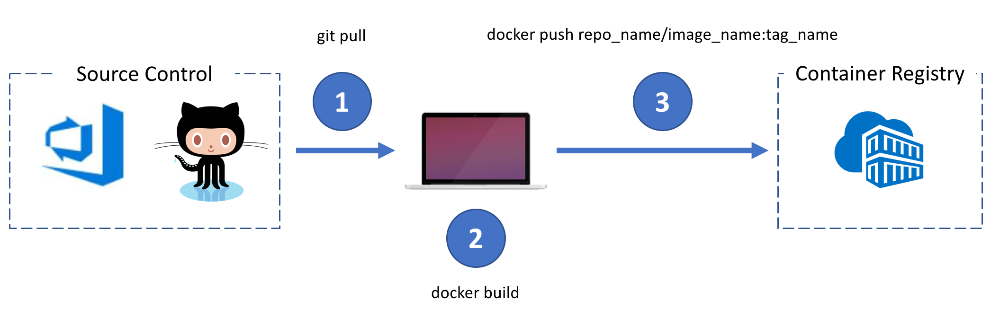

# How to Build and Run a Docker Container Image

The purpose of this section is to understand how to build a Container Image from a GitHub Repository (i.e. Application Code) and script a container image build with a ```Dockerfile```. After your custom image is built you will then push it to your own Private Container Registry (i.e. Azure Container Registry (ACR)).



A ```Dockerfile``` has been created already to streamline this process/step for you.  It is found in the [/app/](../../app/Dockerfile) directory at the root of this lab repository.  Open this file in your code editor and take a look at its syntax.  It has inline comments for clarity as to what is happening at each step.
 - This file is an instruction set that outlines to docker:
    - where/what/which base image you will start with
    - to which working directory you wish to start with inside your image
    - what file(s) to copy into your new container image
    - potentially which ports to map to (from your host to your running container) 
    - any potential commands to run inside your container (i.e. how to boot up your applicaion code)

- Next is to build the Container Image. 
    - From the [/app](../../app/) directory on your build machine, run the following command:
    - ```docker build -t myapp:latest .```
        - This will build/create a docker image on your local machine with the name of "```myapp```" and a versioning tag of "```latest```"
            - If you leave off the tag, it will default to "```latest```"
            - Versioning allows us to have a trail/history of previous builds/versions (v1, v2, beta, prod, test, dev etc.)
            - the trailing ```.``` targets the current directory for the ```Dockerfile```

- Next run the container
  - From the terminal run the following command:
  - ```docker run -it --rm -name demoapp -p 3000:3000 myapp:latest```
  - open a browser and navigate to:
    - ```http://localhost:3000```
  - Voila - you have a working Docker container running a Node (express.js) app

## Next Steps

- [How to Save a Container Image to a Container Registry](../04_)