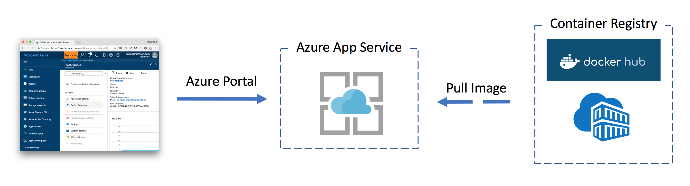
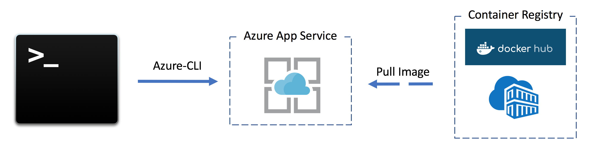

# Deploying to Azure Web App for Containers

In this lab you will be working with "Azure App Service: Web App for Containers" which is one of the simplest ways to get started with building Web or REST-based APIs with Containers on Microsoft Azure.

You will learn how to create an Azure [App Service Plan](https://docs.microsoft.com/en-us/azure/app-service/azure-web-sites-web-hosting-plans-in-depth-overview) which defines the underlying compute service which our App Services are deployed into.

We will then deploy an App Service (Web App for Containers) into this App Service Plan.

## Deployment Methods:

With Azure you can deploy services via the Azure Portal, which is a browser/web ui experience, as well as via a scripted/command line experience via the Azure-CLI.  Below are instructions for both methods.

### Method #1. Deploy a Container via the Azure Portal

The purpose of this section is to help you understand how easy it is to get started with **Web App for Containers** using the Azure Portal.



This method allows you to visually configure your Azure App Service to pull in ```<your_registry_name>.azurecr.io/myapp``` from your private Azure Container Registry
- In the Azure Portal, create a App Service Plan for *LINUX*
    - Once your App Service Plan is created/running, you will need to create a new **Web App for Containers** app, and deploy it to the App Service Plan you just created and configure ``<your_registry_name>.azurecr.io/khbobble`` as the image to pull from your private Azure Container Registry
- Wait a few minutes for the first boot up and your app should be running as expected
- This method is good for running/testing a single container deployment visually.

### [Optional] Method #2. Deploy a Container via the Azure CLI and scripting

The purpose of this section is to help you understand how you can script the createion of **Web for Containers** for DevOps purposes or if you are the type of person that does not like to use GUI Tool.



This method allows you to script and configure your Web App to pull in ``<your_registry_name>.azurecr.io/myapp`` from your private Azure Container Registry
- Using Azure-CLI, create a new app service plan
    - ```az appservice plan create -g <resource-group-name> --name <appservice-plan-name> --is-linux```
    - **Note:** Don't forget ```--is-linux``` flag
- Now create the Web App Service into the App Service Plan
    - ```az webapp create -n <web-app-name> -g <resource-group-name> --plan <appservice-plan-name> -i <docker-image-name>```
        - ***Note:*** On initial setup you will need to give this a public docker image to use e.g. ```mongo```
    - ***Note:*** Don't forget to specify a container image source ```-i``` flag
- Now customize/reconfigure to use your private azure container registry
    - ```az webapp config container set -n <web-app-name> -g <resource-group-name> -c <container-name> -r <azure-container-registry-url> -u <username> -p <password>```
- Wait a few minutes for the first boot up and your app should be running as expected
- This method is best for an automated scripted deployment process

*NOTE:* If you are stuck, check out the [command_examples.sh](command_examples.sh) file in this folder.

## Advanced:

1. Implement/Activate Continuous Deployment with Docker Containers from the Azure Portal or Azure-CLI
